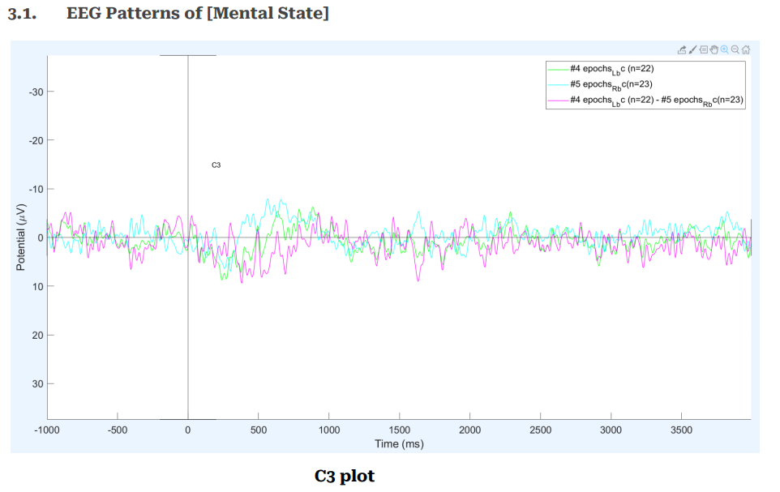
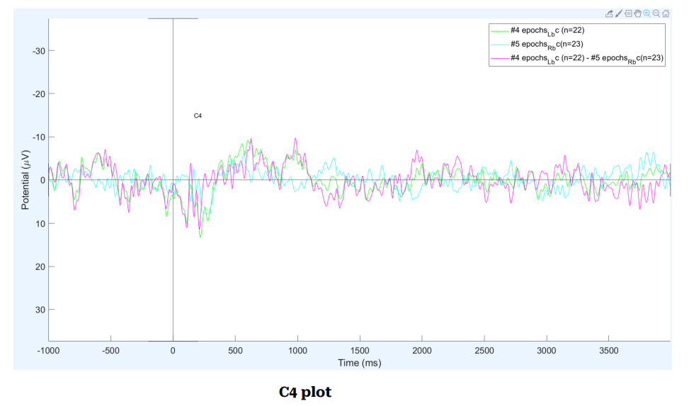
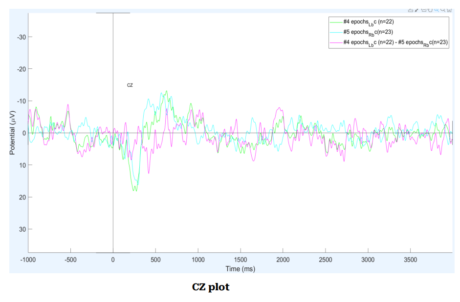
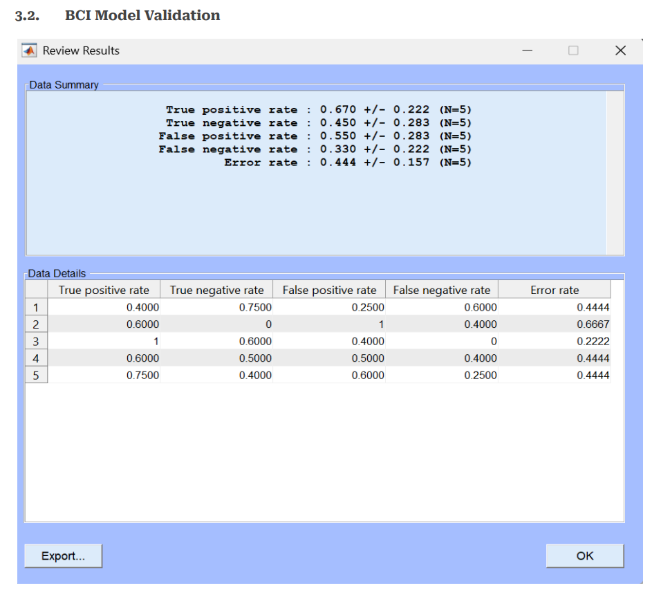
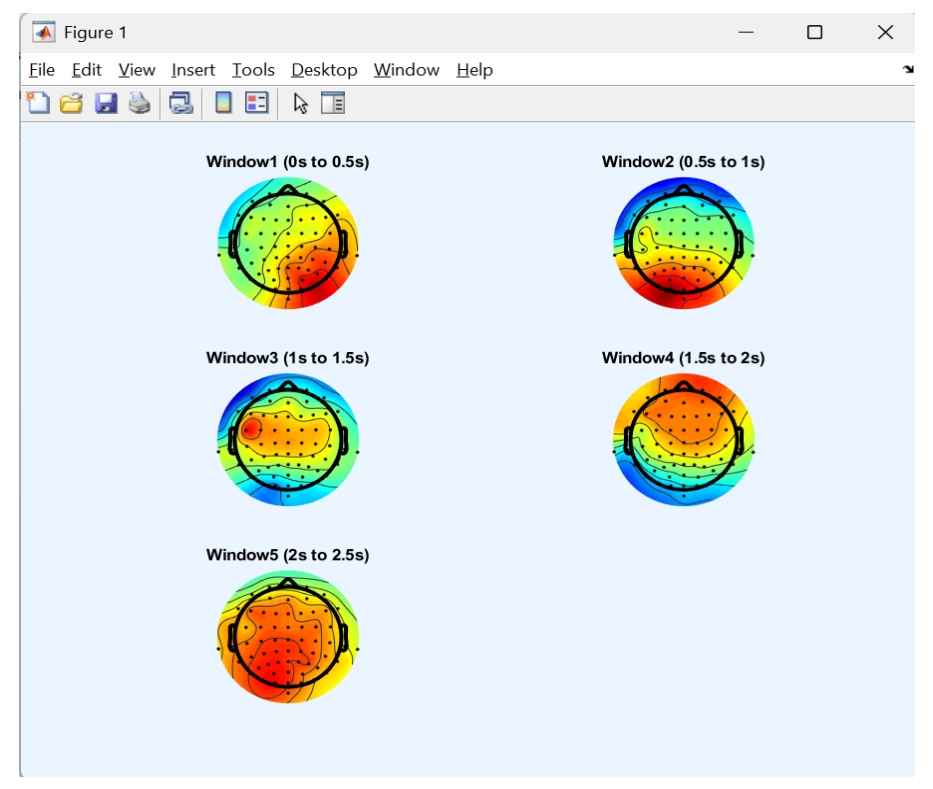

# MotorImagery-BCI-Pipeline
<h1>EEG Motor Imagery Classification – Subject S008</h1>

This repository contains a complete pipeline for processing and classifying 
EEG motor imagery data using <strong>MATLAB 2019a</strong>, 
<strong>EEGLAB</strong> and <strong>BCILAB</strong>. The project focuses on 
left vs. right hand motor imagery for <strong>Subject S008</strong> from the 
<em>EEG Motor Movement/Imagery Dataset</em> (Schalk et al., 2022).

<h2>1. Project Context</h2>

This project was developed as part of a university course on 
<strong>Brain–Computer Interfaces (BCI)</strong>. The course explores how 
brain signals can be recorded, processed and translated into meaningful 
commands for external systems. One of the central topics is 
<em>motor imagery (MI)</em>—imagining a movement without physically performing it.
Although no muscles move, MI generates distinct EEG patterns, especially over 
sensorimotor areas, that can be decoded by machine learning models.

The assignment required implementing a <strong>complete EEG analysis and 
classification workflow</strong> on real motor imagery data. The main learning 
goals were:

<ul>
  <li>Loading and inspecting raw EEG recordings</li>
  <li>Filtering, re-referencing and artifact removal (ICA)</li>
  <li>Identifying event markers and segmenting trials</li>
  <li>Extracting features relevant for motor imagery</li>
  <li>Training and evaluating a classifier in BCILAB</li>
</ul>

For this purpose, I selected <strong>Subject S008</strong> from the 
<em>EEG Motor Movement/Imagery Dataset</em> hosted on OpenNeuro. The dataset 
provides high-quality 64-channel EEG with well-defined event markers for 
left-hand (<code>T1</code>) and right-hand (<code>T2</code>) imagery, recorded 
at 160 Hz. Working with a single subject made it possible to carry out a 
detailed single-subject analysis, which is common in introductory BCI research.

All processing steps were implemented using the graphical interfaces of 
<strong>EEGLAB</strong> and <strong>BCILAB</strong>, following and adapting the 
step-by-step workflow demonstrated in the course material (oddball example). 
The focus of this project is on understanding and documenting the preprocessing 
and classification pipeline, rather than on custom scripting.

<h2>2. Dataset</h2>

<ul>
  <li><strong>Dataset:</strong> EEG Motor Movement/Imagery Dataset (OpenNeuro ds004362)</li>
  <li><strong>Subject:</strong> S008</li>
  <li><strong>Task:</strong> Left vs. right hand motor imagery</li>
  <li><strong>Channels:</strong> 64 (extended 10–10 system)</li>
  <li><strong>Sampling rate:</strong> 160 Hz</li>
  <li><strong>Events:</strong> <code>T1</code> (left hand), <code>T2</code> (right hand), <code>T0</code> (rest)</li>
  <li><strong>Recording length:</strong> ~369 s, 92 events</li>
</ul>

<h2>3. Methods</h2>

<h3>3.1 Preprocessing (EEGLAB)</h3>

<ul>
  <li>Load <code>S008_L_vs_R_hand.set</code> and assign 3D channel locations using <code>standard_1005.elc</code>.</li>
  <li>Band-pass filter: 1–40 Hz (optional 50 Hz notch).</li>
  <li>Average re-reference across all channels.</li>
  <li>Detect and remove clearly noisy channels.</li>
  <li>Run ICA (runica) and remove artifact components using ICLabel (eye/muscle components).</li>
  <li>Epoch the data around <code>T1</code> and <code>T2</code> events 
      (e.g. −1 to 4 s relative to cue).</li>
  <li>Apply baseline correction (e.g. −1 to 0 s).</li>
</ul>

<h3>3.2 Feature Extraction & Classification (BCILAB)</h3>

<ul>
  <li>Load the cleaned, epoched dataset into BCILAB.</li>
  <li>Use either bandpower features (8–12 Hz, 13–30 Hz) or a CSP-based approach 
      in the 8–30 Hz range, focusing on channels around C3/C4.</li>
  <li>Define the analysis window (e.g. 0.5–3.5 s after cue).</li>
  <li>Train a classifier (e.g. LDA) with k-fold cross-validation.</li>
  <li>Inspect performance metrics: accuracy, true/false positive and negative rates, 
      error rate.</li>
</ul>

<h2>4. Results</h2>

<h3>4.1 EEG Patterns at Motor Areas</h3>

The following plots show averaged time-domain activity for channels 
<strong>C3</strong>, <strong>C4</strong> and <strong>Cz</strong>. Each trace 
represents the mean across multiple epochs aligned to cue onset (0 ms) for 
the different conditions. These waveforms provide a first impression of 
how motor imagery modulates sensorimotor potentials over time.

  

<em>Figure 1 – C3 plot.</em>

  

<em>Figure 2 – C4 plot.</em>

  

<em>Figure 3 – Cz plot.</em>

<h3>4.2 BCI Model Validation</h3>

Classification performance was evaluated within BCILAB using cross-validation. 
The BCILAB review window summarizes the true positive and true negative rates, 
false positive and false negative rates, and the overall error rate across folds. 
These metrics provide a quantitative measure of how well left vs. right hand 
motor imagery can be discriminated for Subject S008.

  

<em>Figure 4 – BCILAB model validation summary.</em>

<h3>4.3 Scalp Topographies</h3>

The scalp maps below visualize the spatial distribution of activity in several 
successive time windows after cue onset. Stronger modulation over 
sensorimotor regions (around C3 and C4) is consistent with lateralized 
motor imagery. These topographies help link the classifier’s behaviour to 
neurophysiological patterns in the data.

  

<em>Figure 5 – Scalp topographies for five post-stimulus time windows.</em>

<h2>5. Citation</h2>

If you use this dataset, please cite:

Schalk, G., McFarland, D. J., Hinterberger, T., Birbaumer, N., &amp; Wolpaw, J. R. (2022). 
<em>EEG Motor Movement/Imagery Dataset</em> [Dataset]. OpenNeuro. 
<a href="https://doi.org/10.18112/openneuro.ds004362.v1.0.0">
https://doi.org/10.18112/openneuro.ds004362.v1.0.0</a>

Schalk, G., McFarland, D. J., Hinterberger, T., Birbaumer, N., &amp; Wolpaw, J. R. (2004). 
BCI2000: A general-purpose brain–computer interface (BCI) system. 
<em>IEEE Transactions on Biomedical Engineering, 51</em>(6), 1034–1043.

